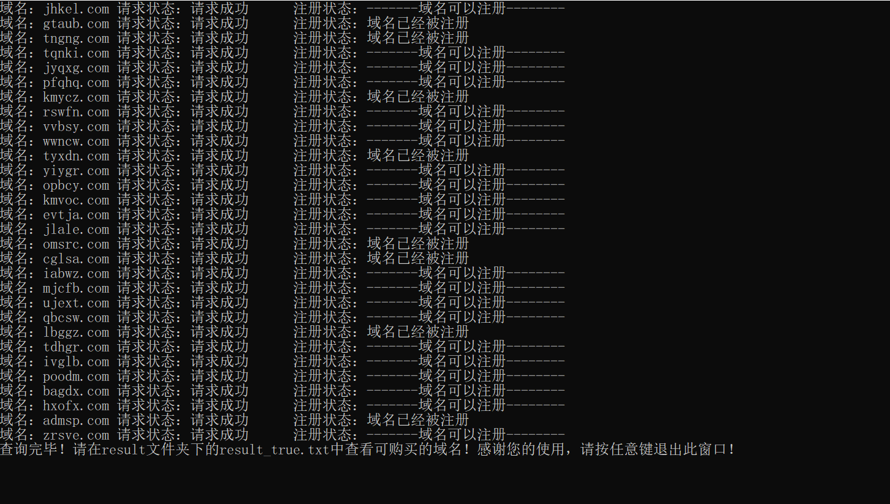

---
author:摘繁华-蓝白社区 联合出品
---

# 域名生成与查询

## 文件说明：

- [x] .py源文件
- [x] .exe可执行文件
- [x] .config.json配置文件

`ps`: *.exe和config.json必须在同一文件夹中*

## 运行说明：

1. 修改config.json 配置文件为您需要的查询条件
2. 点击exe直接运行

`config.json` 配置要点

| 配置项      | 配置详解     | 配置类型 | 可否为空 | 示例                  |
| ----------- | ------------ | -------- | -------- | --------------------- |
| domain_list | 域名可选字典 | list     | 是       | ["a","b","c"] or []        |
| count       | 域名生成数量 | int      | 否       | 10 不能写0哦                    |
| bits        | 域名长度     | int      | 否       | 5  不能写0哦            |
| ext         | 域名后缀     | list     | 是       | [".com",".cn",".net"] or [] |

